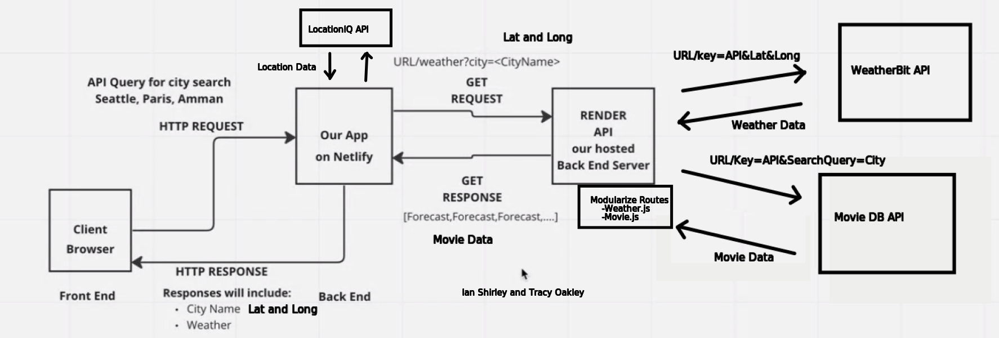
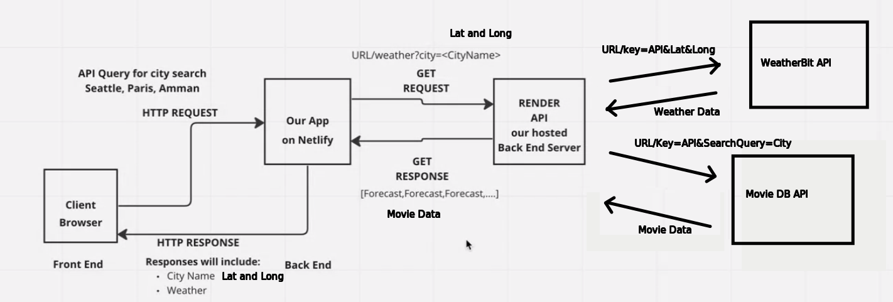
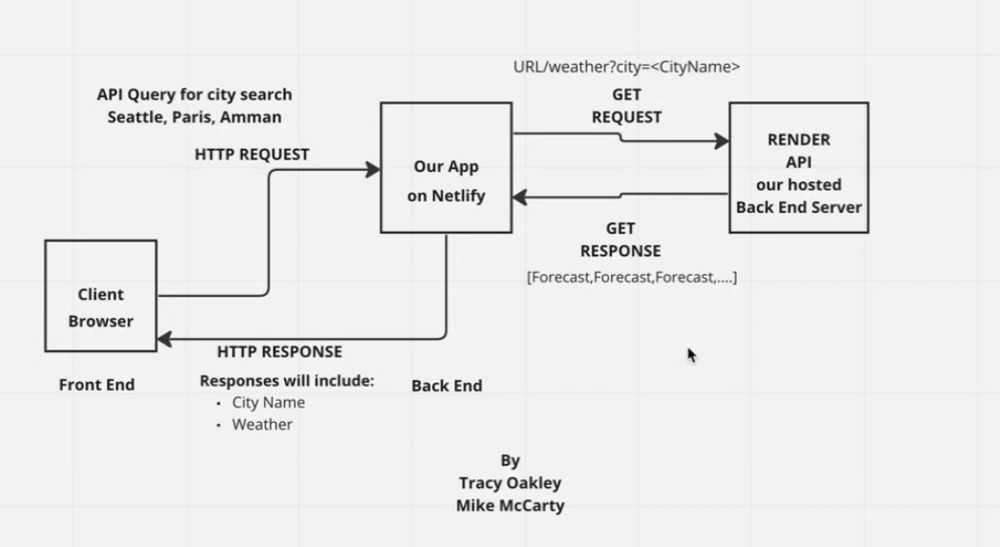

# City-Explorer

## Change Log

Name of feature: Componentize the front End code base
Estimate of time needed to complete: 1 hour
Start time: 4:30
Finish time: 6:30
Actual time needed to complete: 2 hours

**Author**: Tracy Oakley
**Version**: 1.3.0 (increment the patch/fix version number if you make more commits past your first submission)

## Overview

Look up the maps of different cities across the world.

## Getting Started

Need to get your own API key from LocationID and add it to an .env file.

## Architecture

We are using React with class Components and using axios to call our LocationID API.

## Change Log

Name of feature: Setup React Repo and API keys
Estimate of time needed to complete: 1 hour
Start time: 2:30
Finish time:4:00
Actual time needed to complete: 1.5 hours

Name of feature: Location - Latitude and Longitude
Estimate of time needed to complete: 1 hour
Start time: 4:00
Finish time: 5:30
Actual time needed to complete: 1.5 hours

Name of feature: Display a Map
Estimate of time needed to complete: 1 hour
Start time: 5:30
Finish time: 6:15
Actual time needed to complete: 45 mins

Name of feature: Display an Error Message
Estimate of time needed to complete: 1 hour
Start time: 6:30
Finish time: 7:00
Actual time needed to complete: 30 mins

<!-- Use this area to document the iterative changes made to your application as each feature is successfully implemented. Use time stamps. Here's an example:

01-01-2001 4:59pm - Application now has a fully-functional express server, with a GET route for the location resource. -->

## Credit and Collaborations
<!-- Give credit (and a link) to other people or resources that helped you build this application. -->
